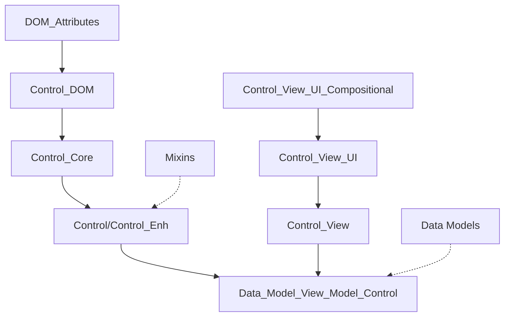
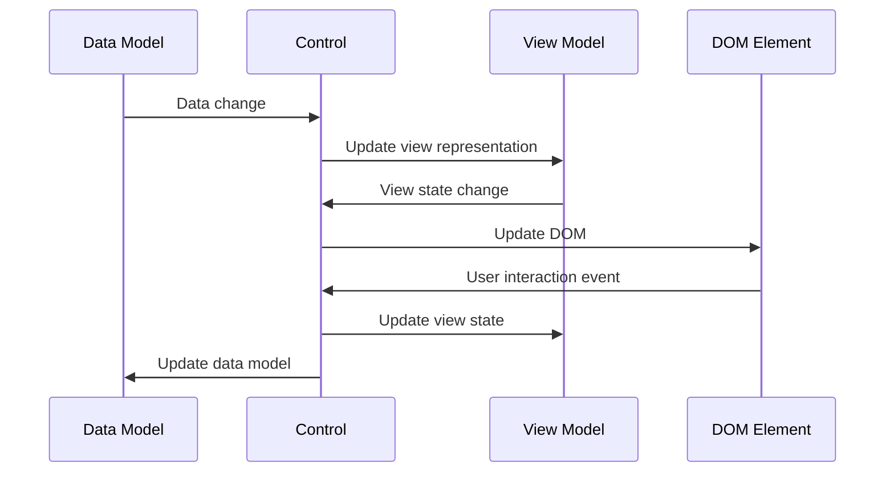
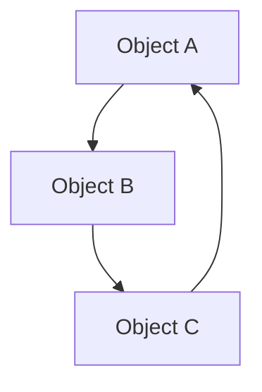

# Model-View-ViewModel Architecture in jsgui3-html

## 1. Current Architecture Overview

The jsgui3-html framework implements a sophisticated component architecture that shares characteristics with both MVC (Model-View-Controller) and MVVM (Model-View-ViewModel) patterns. This document analyzes the current state of the system and proposes enhancements to improve state management, persistence, and isomorphic operation.

### 1.1 Core Components



The architecture centers around several key classes:

| Class | Purpose |
|-------|---------|
| `Control_Core` | Base class providing DOM manipulation, event handling, and rendering |
| `Control` / `Control_Enh` | Enhanced controls with compositional models and data binding |
| `Data_Model_View_Model_Control` | Controls with explicit separation of data and view models |
| `Control_View` | Manages the visual representation aspects of a control |
| `Control_View_UI` | Handles UI-specific aspects like composition and active states |
| `Control_DOM` | Manages DOM-related functionality |
| `DOM_Attributes` | Handles DOM attributes and their updates |

### 1.2 Data Flow Patterns



The current system attempts to implement bidirectional data flow:

1. **Data Model → View Model**: Changes in the data model propagate to update the view model
2. **View Model → DOM**: View model changes update the DOM representation
3. **DOM → View Model → Data Model**: User interactions update the view model, which then updates the data model

## 2. Current Implementation Analysis

### 2.1 State Management

Currently, state is managed through several mechanisms:

#### 2.1.1 Data Models

The foundation of data in controls is primarily through the `data.model` property. From examining `Data_Model_View_Model_Control.js`, we can see:

```javascript
if (spec.data) {
    this.data = new Control_Data();
    if (spec.data.model) {
        this.data.model = spec.data.model;
        this.data.model.on('change', e => {
            console.log('Data_Model_View_Model_Control this.data.model change e:', e);
        })
        this.dom.attributes['data-jsgui-data-model'] = this.data.model._id();
    }
}
```

This sets up the data model and registers it with DOM attributes for serialization.

#### 2.1.2 View Models

View models are managed through the `view.data.model` property:

```javascript
if (!spec.view.data) {
    // create new view data model.
    const view_data_model = new Data_Object({context});
    this.view.data = {
        model: view_data_model
    }
} else {
    this.view.data = spec.view.data;
    if (!this.view.data.model) {
        this.view.data.model = new Data_Object({context});
    }
}
```

This establishes a separate model for the view representation of data.

#### 2.1.3 Mixins for State Behaviors

Multiple mixins add state-related behaviors:

- `selectable.js`: Adds selection state and UI behavior
- `dragable.js`: Adds dragging state and behavior 
- `pressed-state.js`: Manages press state representation

These mixins modify both the view model and DOM representation:

```javascript
// From selectable.js
ctrl.on('change', e_change => {
    let { name, value } = e_change;
    if (name === 'selected') {
        if (value) {
            ctrl.add_class('selected');
        } else {
            ctrl.remove_class('selected');
        }
    };
    return true;
});
```

### 2.2 Serialization and Deserialization

The current approach to serialization focuses heavily on HTML attributes:

#### 2.2.1 Serializing to HTML

In `control-core.js`, models are serialized during rendering:

```javascript
if (this.data && this.data._model instanceof Data_Model) {
    const dmid = this.data._model.__id;
    if (dmid) {
        arr.push(' data-jsgui-data-model-id="' + dmid + '"');
    }
}
```

#### 2.2.2 Deserializing from HTML

During activation, the system attempts to restore models from HTML attributes:

```javascript
// From control-enh.js
if (this.dom.attributes["data-jsgui-data-model-id"] !== undefined) {
    const context_referenced_data_model = this.context.map_data_models[this.dom.attributes["data-jsgui-data-model-id"]];
    if (context_referenced_data_model) {
        this.data.model = context_referenced_data_model;
        console.log('have used data.model referenced from context: ' + context_referenced_data_model.__id);
    }
}
```

#### 2.2.3 Mixin Serialization

Mixins also implement their own serialization:

```javascript
// From selectable.js
ctrl.on('server-pre-render', e => {
    if (ctrl.selectable === true) {
        ctrl._fields = ctrl._fields || {};
        ctrl._fields.selectable = true;
        if (ctrl.selected === true) {
            ctrl._fields.selected = true;
        }
    }
})
```

### 2.3 Limitations of Current Implementation

After analyzing the code, several limitations become apparent:

#### 2.3.1 Incomplete Model Synchronization

The current implementation uses manual event binding between data models and view models, with minimal actual synchronization logic:

```javascript
// In Data_Model_View_Model_Control.js
this.data.model.on('change', e => {
    console.log('Data_Model_View_Model_Control this.data.model change e:', e);
    // No actual view model update happens here
})
```

```javascript
// In pressed-state.js
ctrl.view.data.model.on('change', e_change => {
    const {name, value} = e_change;
    if (name === 'state') {
        if (value === 'pressed') {
            ctrl.add_class('pressed');
        } else if (value === 'not-pressed') {
            ctrl.remove_class('pressed');
        }
    }
});
```

The connections between models are explicit but inconsistent, with each control or mixin implementing its own synchronization pattern. No systematic mechanism exists to ensure that data model changes are reflected in the view model or vice versa.

**Improved Approach Example:**

```javascript
// Declarative binding definition
class DatePicker extends Data_Model_View_Model_Control {
    constructor(spec) {
        super(spec);
        
        // Define bindings with transformations
        this.bind({
            // data.model.property: view.data.model.property
            'date': {
                to: 'formattedDate',
                transform: (date) => format_date(date, this.view.data.model.format)
            },
            'enabled': {
                to: 'interactive',
                transform: (enabled) => enabled && !this.view.data.model.readOnly
            }
        });
    }
}
```

**Implementation Considerations:**
- Add a binding system to `Data_Model_View_Model_Control` that accepts property mappings
- Implement automatic subscription to change events on both models
- Support transformation functions for data conversion
- Enable two-way binding with separate transform functions for each direction
- Maintain compatibility by allowing existing manual bindings to work alongside the new system

#### 2.3.2 Limited Complex Data Structure Support

The current serialization mechanism focuses primarily on references via IDs, with limited ability to handle complex structured data:

```javascript
// In control-core.js
if (this.data && this.data._model instanceof Data_Model) {
    const dmid = this.data._model.__id;
    if (dmid) {
        arr.push(' data-jsgui-data-model-id="' + dmid + '"');
    }
}
```

```javascript
// In control-enh.js
if (this.dom.attributes["data-jsgui-data-model-id"] !== undefined) {
    const context_referenced_data_model = 
        this.context.map_data_models[this.dom.attributes["data-jsgui-data-model-id"]];
    if (context_referenced_data_model) {
        this.data.model = context_referenced_data_model;
        console.log('have used data.model referenced from context: ' + 
            context_referenced_data_model.__id);
    }
}
```

This approach works for primitive values or when models exist in the context, but struggles with:
- Nested objects and arrays
- Circular references
- Custom types like Dates or specialized collections
- Large data structures that would benefit from partial loading

**Improved Approach Example:**

```javascript
// Serialized complex object with reference handling
{
    "type": "DataGrid_Model",
    "id": "model_123",
    "fields": {
        "records": {
            "__type": "array",
            "items": [
                {
                    "__type": "Record",
                    "id": "rec_1",
                    "fields": {
                        "name": "Example",
                        "date": {
                            "__type": "Date",
                            "value": "2023-09-01T00:00:00.000Z"
                        }
                    }
                },
                { "__ref": "rec_2" }
            ]
        },
        "config": {
            "__lazy_ref": true,
            "__id": "config_456"
        }
    }
}
```

**Implementation Considerations:**
- Create a specialized serialization format that handles complex object graphs
- Implement reference tracking to handle circular references
- Add type information for proper reconstruction of custom types
- Support lazy loading for large objects or collections
- Ensure HTML attribute size limits are respected by potentially storing large data elsewhere

#### 2.3.3 Inconsistent Mixin State Handling

The current mixin implementation shows inconsistent approaches to state management and persistence:

```javascript
// In selectable.js
if (ctrl.selectable === true) {
    ctrl._fields = ctrl._fields || {};
    ctrl._fields.selectable = true;
    if (ctrl.selected === true) {
        ctrl._fields.selected = true;
    }
}
```

```javascript
// In dragable.js
const setup_isomorphic = () => {
    const old_silent = ctrl.view.data.model.mixins.silent;
    ctrl.view.data.model.mixins.silent = true;
    ctrl.view.data.model.mixins.push({
        name: 'dragable'
    });
    ctrl.view.data.model.mixins.silent = old_silent;
    field(ctrl, 'dragable');
}
```

```javascript
// In pressed-state.js
ctrl.view.data.model.on('change', e_change => {
    const {name, value} = e_change;
    if (name === 'state') {
        if (value === 'pressed') {
            ctrl.add_class('pressed');
        } else if ( value === 'not-pressed') {
            ctrl.remove_class('pressed');
        }
    }
});
```

Each mixin has its own approach to:
- Where state is stored (on the control directly vs. in view model)
- How state changes are monitored
- How state is serialized and restored
- How state affects the DOM

**Improved Approach Example:**

```javascript
// Standard mixin state management
const selectable = (ctrl, options = {}) => {
    // Register mixin with standard state management
    const state = ctrl.mixin_state('selectable', {
        selected: options.selected || false,
        selectable: options.selectable !== false
    });
    
    // State changes automatically trigger DOM updates
    state.on_change('selected', value => {
        ctrl.toggle_class('selected', value);
    });
    
    // Handle DOM events affecting state
    ctrl.on('click', () => {
        if (state.selectable) {
            state.selected = !state.selected;
        }
    });
}
```

**Implementation Considerations:**
- Create a mixin state registry mechanism in the Control class
- Store all mixin states in a consistent location (e.g., `view.data.model.mixins`)
- Implement automatic serialization of mixin states
- Provide standard patterns for state-to-DOM binding
- Refactor existing mixins to use the new system while maintaining backward compatibility

#### 2.3.4 Manual Event Wiring

Current controls require explicit event wiring for data flow between DOM, view models, and data models:

```javascript
// In Data_Model_View_Model_Control.js
this.data.model.on('change', e => {
    console.log('Data_Model_View_Model_Control this.data.model change e:', e);
})

this.view.data.model.on('change', e => {
    console.log('Data_Model_View_Model_Control this.view.data.model change e:', e);
})
```

This leads to several issues:
- Verbose boilerplate code for common patterns
- Inconsistent handling of events across different controls
- Risk of memory leaks due to forgotten event listener removals
- Complex debugging when events aren't working as expected

**Improved Approach Example:**

```javascript
// Declarative event flow configuration
class InputField extends Data_Model_View_Model_Control {
    constructor(spec) {
        super(spec);
        
        // Define data flow
        this.connect({
            // DOM → view model → data model
            'input': {
                // When DOM input event occurs
                dom_event: 'input',
                // Update view model property
                to_view: 'displayValue',
                // Then update data model property (with transformation)
                to_data: 'value',
                transform: (display) => parseValue(display)
            },
            
            // data model → view model → DOM
            'value': {
                // When data model property changes
                from_data: 'value',
                // Update view model property
                to_view: 'displayValue',
                // Then update DOM property
                to_dom: 'value',
                transform: (value) => formatValue(value)
            }
        });
    }
}
```

**Implementation Considerations:**
- Create a declarative API for defining event and data flows
- Implement automatic event listener management
- Support transformations for data passing between layers
- Enable conditional flows based on state
- Ensure backward compatibility with manual event wiring

#### 2.3.5 Debugging Complexity

The current architecture makes debugging challenging due to:

1. **State Distribution**: State is spread across multiple objects (control, DOM, data model, view model)
2. **Implicit Connections**: Many connections between state objects are implicitly handled
3. **Inconsistent Patterns**: Different controls handle state changes differently
4. **Limited Tracing**: Lack of centralized logging for state changes

**Improved Approach Example:**

```javascript
// Enhanced debugging support
ctrl.debug_mode = true; // Enable debugging

// Automatically generates logs like:
// [Control:Button#btn-1] Data Model Change: enabled=true
// [Control:Button#btn-1] View Model Update: interactive=true
// [Control:Button#btn-1] DOM Update: class=+interactive,-disabled
```

```javascript
// State inspector tool
// In browser console:
ctrl.inspect()
// Outputs all state, model bindings, and active listeners
```

**Implementation Considerations:**
- Add debugging middleware to model change events
- Create a state inspection API for controls
- Implement developer tools integration
- Add transaction tracking for related state changes
- Ensure minimal performance impact when debugging is disabled

#### 2.3.6 Redundant Code

The codebase contains significant redundancy in common operations:

```javascript
// Pattern repeated in multiple mixins
const setup_isomorphic = () => {
    const old_silent = ctrl.view.data.model.mixins.silent;
    ctrl.view.data.model.mixins.silent = true;
    ctrl.view.data.model.mixins.push({
        name: 'selectable'
    });
    ctrl.view.data.model.mixins.silent = old_silent;
}
```

```javascript
// Pattern repeated in many controls
if (ctrl.view.data.model) {
    ctrl.view.data.model.on('change', e => {
        const {name, value} = e;
        if (name === 'someProperty') {
            // Handle property change
        }
    })
}
```

This repetition leads to:
- Increased code size
- Inconsistent implementations
- Higher maintenance burden
- Difficulty implementing system-wide changes

**Improved Approach Example:**

```javascript
// Utility functions for common patterns
ctrl.register_mixin('selectable');

ctrl.bind_view_to_dom('someProperty', {
    type: 'class',
    class: 'active',
    condition: value => value === true
});
```

**Implementation Considerations:**
- Extract common patterns into utility functions
- Create high-level APIs for frequent operations
- Implement a plugin system for extending functionality
- Maintain backward compatibility with existing patterns
- Document the new utilities thoroughly

## 3. Proposed Enhancements

Based on the analysis, here are recommended enhancements to improve state management:

### 3.1 Unified Model Management

#### 3.1.1 Model Registry

Create a centralized registry for all models (both data and view) that maintains references and handles serialization/deserialization:

```javascript
class ModelRegistry {
    constructor(context) {
        this.context = context;
        this.data_models = new Map();
        this.view_models = new Map();
    }
    
    register_data_model(id, model) {
        this.data_models.set(id, model);
        return model;
    }
    
    register_view_model(id, model) {
        this.view_models.set(id, model);
        return model;
    }
    
    get_data_model(id) {
        return this.data_models.get(id);
    }
    
    get_view_model(id) {
        return this.view_models.get(id);
    }
    
    serialize_all() {
        // Serialize all models to a transportable format
    }
    
    deserialize_all(data) {
        // Deserialize and rebuild models
    }
}
```

This registry would be accessible through the context:

```javascript
context.model_registry = new ModelRegistry(context);
```

### 3.2 Enhanced Serialization and Deserialization

#### 3.2.1 Model Serialization Format

Define a standardized serialization format for complex models:

```javascript
class ModelSerializer {
    static serialize_model(model) {
        return {
            type: model.constructor.name,
            id: model.__id,
            fields: Object.fromEntries(
                Object.entries(model._)
                .filter(([key, _]) => key !== '_bound_events')
                .map(([key, value]) => [key, this.serialize_value(value)])
            )
        };
    }
    
    static serialize_value(value) {
        if (value instanceof Data_Object) {
            return {
                __type: 'data_object',
                __id: value.__id,
                __ref: true
            };
        }
        // Handle other types (arrays, primitives, etc.)
        // ...
    }
    
    static deserialize_model(data, context) {
        // Recreate the model from serialized data
    }
}
```

#### 3.2.2 HTML Attribute Optimization

Implement a more efficient attribute serialization that can handle complex object references:

```javascript
// In control-core.js renderDomAttributes
if (this.data && this.data.model) {
    const model_data = ModelSerializer.get_reference_data(this.data.model);
    dom_attrs['data-jsgui-model'] = JSON.stringify(model_data).replace(/"/g, "'");
}

if (this.view && this.view.data && this.view.data.model) {
    const view_model_data = ModelSerializer.get_reference_data(this.view.data.model);
    dom_attrs['data-jsgui-view-model'] = JSON.stringify(view_model_data).replace(/"/g, "'");
}
```

### 3.3 Automatic Model Binding

#### 3.3.1 Declarative Data Binding

Create a declarative way to bind data model properties to view model properties:

```javascript
class ModelBinder {
    constructor(data_model, view_model, bindings) {
        this.data_model = data_model;
        this.view_model = view_model;
        this.bindings = bindings;
        this.setup_bindings();
    }
    
    setup_bindings() {
        Object.entries(this.bindings).forEach(([data_prop, view_prop]) => {
            // Initial sync
            if (this.data_model[data_prop] !== undefined) {
                this.view_model[view_prop] = this.transform_data_to_view(
                    data_prop, 
                    this.data_model[data_prop]
                );
            }
            
            // Data → View
            this.data_model.on('change', e => {
                if (e.name === data_prop) {
                    this.view_model[view_prop] = this.transform_data_to_view(
                        data_prop, 
                        e.value
                    );
                }
            });
            
            // View → Data
            this.view_model.on('change', e => {
                if (e.name === view_prop) {
                    this.data_model[data_prop] = this.transform_view_to_data(
                        view_prop, 
                        e.value
                    );
                }
            });
        });
    }
    
    transform_data_to_view(prop, value) {
        // Apply transformations (e.g., date formatting)
        return value; 
    }
    
    transform_view_to_data(prop, value) {
        // Apply reverse transformations
        return value;
    }
}
```

Usage in a control:

```javascript
new ModelBinder(this.data.model, this.view.data.model, {
    'date': 'formatted_date',
    'price': 'formatted_price',
    // ...
});
```

### 3.4 State Management for Mixins

#### 3.4.1 Standardized Mixin State

Create a unified approach for mixins to interact with models:

```javascript
const mixin_state_manager = (ctrl, mixin_name, initial_state = {}) => {
    // Ensure the view model has a mixins collection
    if (!ctrl.view.data.model.mixins) {
        ctrl.view.data.model.mixins = new Collection();
    }
    
    // Create or get the mixin state
    let mixin_state = ctrl.view.data.model.mixins.find(m => m.name === mixin_name);
    
    if (!mixin_state) {
        mixin_state = new Data_Object({
            name: mixin_name,
            state: initial_state
        });
        ctrl.view.data.model.mixins.add(mixin_state);
    }
    
    // Setup serialization
    ctrl.on('server-pre-render', () => {
        ctrl._fields = ctrl._fields || {};
        ctrl._fields[`mixin_${mixin_name}`] = mixin_state.state;
    });
    
    // Return the state object for the mixin to use
    return mixin_state.state;
};
```

Usage in a mixin:

```javascript
const selectable = (ctrl, options = {}) => {
    const state = mixin_state_manager(ctrl, 'selectable', {
        selected: false,
        selectable: true
    });
    
    // Use state.selected instead of ctrl.selected
    // ...
    
    ctrl.on('change', e => {
        if (e.name === 'selectable' || e.name === 'selected') {
            state[e.name] = e.value;
            // Update UI based on state
        }
    });
};
```

## 4. Implementation Roadmap

### 4.1 Phase 1: Foundation Updates

1. **Model Registry Implementation**
   - Create `ModelRegistry` class in a new file: `/c:/Users/james/Documents/repos/jsgui3-html/html-core/model-registry.js`
   - Integrate with `Page_Context` for access throughout the app

2. **Serialization/Deserialization System**
   - Create `ModelSerializer` class in `/c:/Users/james/Documents/repos/jsgui3-html/html-core/model-serializer.js`
   - Implement methods for different data types
   - Add HTML attribute handling to `control-core.js`

### 4.2 Phase 2: Binding System

1. **Data Binding**
   - Create `ModelBinder` class in `/c:/Users/james/Documents/repos/jsgui3-html/html-core/model-binder.js`
   - Implement transformation functions for common data types
   
2. **Integration with Control Classes**
   - Enhance `Data_Model_View_Model_Control` to use new binding system
   - Add binding options to control specifications

### 4.3 Phase 3: Mixin Standardization

1. **Mixin State Manager**
   - Create mixin state manager in `/c:/Users/james/Documents/repos/jsgui3-html/control_mixins/mixin-state-manager.js`
   
2. **Update Existing Mixins**
   - Refactor `selectable.js`, `dragable.js`, etc. to use standard state management

### 4.4 Phase 4: Testing and Optimization

1. **Comprehensive Tests**
   - Create tests for model serialization
   - Test isomorphic operation
   - Test complex data structure handling

2. **Performance Optimization**
   - Optimize serialization for large models
   - Implement lazy loading for complex structures
   - Add caching where appropriate

## 5. Complex Data Structure Handling

### 5.1 Circular References

For data structures with circular references:



Implement a reference tracking system:

```javascript
class ReferenceTracker {
    constructor() {
        this.seen_objects = new WeakMap();
        this.reference_id = 0;
    }
    
    track(obj) {
        if (this.seen_objects.has(obj)) {
            return {
                __ref: true,
                __id: this.seen_objects.get(obj)
            };
        }
        
        const id = `ref_${this.reference_id++}`;
        this.seen_objects.set(obj, id);
        return null; // No reference yet
    }
}
```

### 5.2 Custom Object Types

For user-defined objects that need special serialization, implement a registry of serializers:

```javascript
class SerializerRegistry {
    constructor() {
        this.serializers = new Map();
    }
    
    register(type_name, serializer, deserializer) {
        this.serializers.set(type_name, { serializer, deserializer });
    }
    
    get(type_name) {
        return this.serializers.get(type_name);
    }
}
```

Example registration for a Date object:

```javascript
serializer_registry.register('Date', 
    (date) => ({ __type: 'Date', value: date.toISOString() }),
    (data) => new Date(data.value)
);
```

### 5.3 Lazy Loading

For large data structures, implement lazy loading:

```javascript
class LazyReference {
    constructor(id, loader) {
        this.id = id;
        this.loader = loader;
        this._loaded = false;
        this._value = null;
    }
    
    get value() {
        if (!this._loaded) {
            this._value = this.loader(this.id);
            this._loaded = true;
        }
        return this._value;
    }
}
```

Usage:

```javascript
// In deserialization
if (data.__lazy_ref) {
    return new LazyReference(data.__id, (id) => {
        return context.model_registry.get_data_model(id);
    });
}
```

## 6. Example Implementation Patterns

### 6.1 Date Picker Example

Here's how the proposed system would work with a date picker control:

```javascript
class DatePicker extends Data_Model_View_Model_Control {
    constructor(spec) {
        super(spec);
        
        // Setup data model with raw date
        this.data.model = new Data_Object({
            date: new Date()
        });
        
        // Setup view model with formatted date
        this.view.data.model = new Data_Object({
            formatted_date: '',
            display_format: spec.format || 'YYYY-MM-DD'
        });
        
        // Bind models
        new ModelBinder(this.data.model, this.view.data.model, {
            'date': 'formatted_date'
        }, {
            // Transformations
            date_to_formatted_date: (date) => {
                return format_date(date, this.view.data.model.display_format);
            },
            formatted_date_to_date: (str) => {
                return parse_date(str, this.view.data.model.display_format);
            }
        });
    }
}
```

### 6.2 Data Grid Example

For more complex structure like a data grid:

```javascript
class DataGrid extends Data_Model_View_Model_Control {
    constructor(spec) {
        super(spec);
        
        // Data model with full dataset
        this.data.model = new Data_Object({
            records: spec.data || [],
            total_records: spec.total || 0
        });
        
        // View model with pagination, sorting, etc.
        this.view.data.model = new Data_Object({
            visible_records: [],
            page: 1,
            page_size: spec.page_size || 10,
            sort_column: null,
            sort_direction: 'asc'
        });
        
        // No direct binding - instead use a computed relationship
        this.view.data.model.on('change', () => {
            this.update_visible_records();
        });
        
        this.data.model.on('change', () => {
            this.update_visible_records();
        });
        
        // Initial update
        this.update_visible_records();
    }
    
    update_visible_records() {
        const model = this.data.model;
        const view_model = this.view.data.model;
        
        let records = [...model.records];
        
        // Apply sorting
        if (view_model.sort_column) {
            records.sort((a, b) => {
                let comparison = a[view_model.sort_column] < b[view_model.sort_column] ? -1 : 1;
                return view_model.sort_direction === 'asc' ? comparison : -comparison;
            });
        }
        
        // Apply pagination
        const start = (view_model.page - 1) * view_model.page_size;
        view_model.visible_records = records.slice(start, start + view_model.page_size);
    }
}
```

## 7. Best Practices

### 7.1 Separation of Concerns

1. **Data Model**: Contains raw, unformatted data
2. **View Model**: Contains UI-specific representations of data
3. **Control**: Handles interaction and connects models

### 7.2 Reuse and Extension

1. Create base model classes that implement common patterns
2. Use mixins for cross-cutting concerns
3. Leverage the context for shared resources

### 7.3 Performance Considerations

1. Only serialize what's necessary
2. Use lazy loading for large data structures
3. Avoid circular references where possible
4. **DOM Update Strategies: Diffing vs Direct Manipulation**

   **[Claude's Opinion]:** Virtual DOM diffing can provide benefits when complex UIs undergo frequent small changes. By comparing previous and current states, a diffing algorithm identifies the minimal set of DOM operations needed, potentially reducing layout thrashing and improving rendering performance. This approach is used in React, Vue, and other popular frameworks to minimize expensive DOM operations.

   **[James's Approach]:** Throughout jsgui3-html, James has intentionally avoided DOM diffing in favor of direct, targeted DOM manipulation. This approach has several advantages:

   - **Lower Overhead:** No additional layer of virtual DOM computation and comparison
   - **Direct Control:** The system knows exactly what needs to change based on model updates
   - **Architectural Consistency:** The compositional model provides natural boundaries for updates
   - **Predictable Performance:** No diffing algorithm whose performance might vary by scenario

   **Direct Manipulation Benefits:**
   - The existing compositional architecture already supports granular updates without diffing
   - When properly implemented, direct DOM manipulation can outperform diffing for many scenarios
   - The control system can make precise changes when it has direct knowledge of what changed
   - The current event-based approach allows controls to respond only to relevant changes

   **Diffing Benefits:**
   - More declarative programming model that focuses on "what" not "how"
   - Can simplify development by automating update detection
   - May reduce bugs when complex state changes affect multiple DOM elements
   - Works well for highly dynamic UIs with unpredictable update patterns

   **Implementation Considerations:**
   The jsgui3-html architecture supports targeted updates through its event system and compositional model. Developers can achieve high performance by leveraging these mechanisms rather than implementing diffing algorithms. The key is ensuring that model change events trigger only the necessary DOM updates rather than full re-renders.

   For example, instead of:
   ```javascript
   // Inefficient - rebuilds entire content
   ctrl.on('data_change', () => {
     ctrl.clear();
     ctrl.compose_using_compositional_model();
   });
   ```

   The system should support:
   ```javascript
   // Efficient - updates only affected elements
   ctrl.on('data.model.change', e => {
     if (e.name === 'selectedItem') {
       ctrl._ctrl_fields.itemList.update_selection(e.value);
     }
   });
   ```

   This approach aligns with James's architectural decisions while maintaining high performance.

## 8. Conclusion

The proposed enhancements build upon the solid foundation already in place within the jsgui3-html framework. By standardizing model management, improving serialization, and providing better tools for data binding, the system will become more powerful and easier to work with.

The structured state management approach follows the core principles of MVVM while adapting to the specific needs of isomorphic web applications. Implementing these changes will result in a more robust, maintainable system with clear separation between data and its representation.

This advanced model system will significantly enhance the developer experience by providing:

1. Cleaner, more declarative control definitions
2. Automatic synchronization between data and UI
3. Simpler state persistence across page loads
4. Better support for complex data structures
5. More consistent behavior between server and client rendering

The roadmap presented offers a phased approach to implementation, allowing for incremental improvements while maintaining compatibility with existing code.
