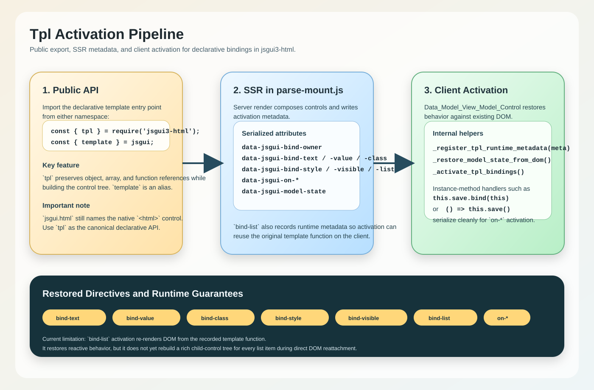

# Declarative Templating and MVVM Binding in jsgui3

This guide covers the modern, declarative approach to building user interfaces in jsgui3-html using the public `jsgui.tpl` tagged template literal and the native MVVM binding syntax.

As of recent updates to the `jsgui3-html` platform, developers no longer need to rely purely on imperative DOM composition and manual event wiring. You can now build highly dynamic and reactive components using a syntax that resembles modern frontend frameworks while maintaining the raw performance and deep integration of the `jsgui3` ecosystem.

## Chapters

1. **[`tpl` Syntax and Usage](01-jsgui-html-syntax.md)**
   Learn how to use the tagged template literal to declaratively construct control hierarchies, pass context, and manage references.
2. **[Native MVVM Data Binding](02-mvvm-data-binding.md)**
   Discover the power of `bind-*` and `on-*` attributes, the `mbind()` helper, and bidirectional data synchronization using the `BindingManager`.

## Quick Example

Here is a quick glimpse of what declarative templating with native MVVM data binding looks like in jsgui3:

```javascript
const jsgui = require('jsgui3-html');
const { tpl } = jsgui;
const Data_Model_View_Model_Control = require('jsgui3-html/html-core/Data_Model_View_Model_Control');

class UserProfile extends Data_Model_View_Model_Control {
    constructor(spec = {}) {
        super(spec);
        
        // Initialize reactive data model
        this.data.model.set('username', 'Guest');
        this.data.model.set('age', 25);

        this.compose_profile();
    }

    compose_profile() {
        // Declaratively construct the UI, mapping fields directly to this.data.model
        tpl`
            <div class="user-profile">
                <h2>User: ${this.data.model.get('username')}</h2>
                
                <div class="form-row">
                    <label>Age:</label>
                    <number_value_editor bind-value=${this.mbind('age')} />
                </div>

                <div class="actions">
                    <button on-click=${() => this.saveProfile()}>Save Changes</button>
                    <button on-click=${this.resetProfile.bind(this)}>Reset</button>
                </div>
            </div>
        `.mount(this);
    }

    saveProfile() {
        console.log("Saving user:", this.data.model.get('username'), "Age:", this.data.model.get('age'));
    }

    resetProfile() {
        this.data.model.set('age', 25);
    }
}
```

Dive into the chapters above to master the declarative API!

## Activation Overview

Server-rendered `tpl` layouts now carry the metadata needed to restore declarative behavior on the client. The main flow is:

1. `tpl` builds controls during SSR.
2. `parse-mount.js` serializes `data-jsgui-bind-*`, `data-jsgui-on-*`, and `data-jsgui-model-state` metadata.
3. `Data_Model_View_Model_Control` restores model state and reattaches bindings during activation.

The current supported SSR-to-activation directive set is:

- `bind-text`
- `bind-value`
- `bind-class`
- `bind-style`
- `bind-visible`
- `bind-list`
- `on-*` for resolvable instance-method handlers

See the flow diagram:


