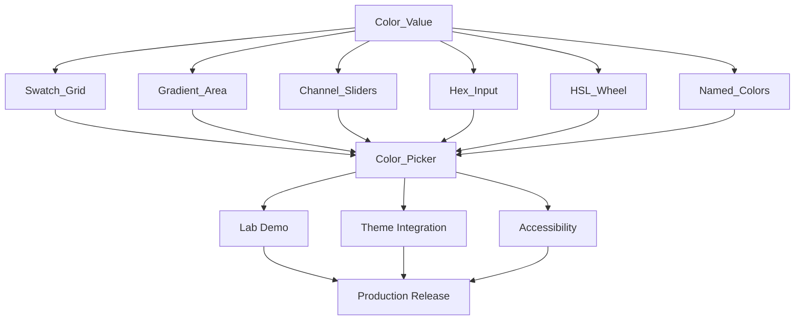

# Chapter 8: Roadmap & Milestones

This chapter defines a phased delivery plan, taking the color picker from its current alpha state to production-ready.

## Phase Overview

```
Phase 1: Foundation          ■■■■░░░░░░░░░░░░  Weeks 1–2
Phase 2: Core Modes          ■■■■■■░░░░░░░░░░  Weeks 3–5
Phase 3: Composite           ■■■■■■■■░░░░░░░░  Weeks 5–7
Phase 4: Polish & Theming    ■■■■■■■■■■░░░░░░  Weeks 7–9
Phase 5: Production Ready    ■■■■■■■■■■■■■■■■  Weeks 9–10
```

---

## Phase 1: Foundation (Weeks 1–2)

**Goal:** Build the color model layer and refactor existing code.

### Deliverables

| Item | File | Description |
|------|------|-------------|
| `Color_Value` class | `html-core/color-value.js` | RGB/HSL/HSV/HEX conversions, utilities |
| `Color_Value` tests | `test/core/color-value.test.js` | 95%+ coverage of conversion logic |
| Palette registry | `html-core/palettes/index.js` | Move `arr_colors.js`, add Material & web-safe |
| Cleanup | `controls/organised/.../color-grid copy.js` | Delete stale duplicate file |
| Refactor `Color_Grid` | `controls/organised/.../color-grid.js` | Use `Color_Value`, add `color` property |

### Exit Criteria
- `Color_Value` passes all round-trip conversion tests
- Existing `Color_Grid` continues to work with the new model
- Multiple palettes are loadable by name

---

## Phase 2: Core Modes (Weeks 3–5)

**Goal:** Build the two most-used picker modes as standalone controls.

### Deliverables

| Item | File | Description |
|------|------|-------------|
| `Swatch_Grid` | `controls/organised/.../2-picker/swatch-grid.js` | Enhanced grid with hover, keyboard, ARIA |
| `Swatch_Grid` tests | `test/controls/swatch-grid.test.js` | Construction, rendering, events |
| `Gradient_Area` | `controls/organised/.../2-picker/gradient-area.js` | 2D SV area + hue slider |
| `Gradient_Area` tests | `test/controls/gradient-area.test.js` | Construction, color API |
| `Hex_Input` | `controls/organised/.../2-picker/hex-input.js` | Text entry with validation |
| `Hex_Input` tests | `test/controls/hex-input.test.js` | Parsing, validation, events |

### Exit Criteria
- Each mode works independently as a control
- Each mode correctly emits `color-change` events with `Color_Value` instances
- Each mode supports `get_value()` / `set_value()` / `color` property

---

## Phase 3: Composite (Weeks 5–7)

**Goal:** Build the tabbed `Color_Picker` and remaining modes.

### Deliverables

| Item | File | Description |
|------|------|-------------|
| `Channel_Sliders` | `.../2-picker/channel-sliders.js` | RGB/HSL slider sets |
| `Named_Colors` | `.../2-picker/named-colors.js` | Searchable named color list |
| `HSL_Wheel` | `.../2-picker/hsl-wheel.js` | Circular hue picker |
| `Color_Picker` | `.../2-picker/color-picker.js` | Tabbed composite with preview bar |
| Integration tests | `test/controls/color-picker.test.js` | Tab sync, event flow, variants |
| Lab demo | `lab/experiments/color_picker_lab.js` | Interactive demo page |

### Exit Criteria
- Switching tabs preserves selected color
- All modes synchronize via the Color_Picker parent
- Preview bar shows old/new color and hex label
- At least `compact`, `standard`, and `full` variants work

---

## Phase 4: Polish & Theming (Weeks 7–9)

**Goal:** Make it look and feel production-quality.

### Deliverables

| Item | Description |
|------|-------------|
| Theme integration | `themeable` mixin on all controls, CSS custom properties |
| Variant registration | All variants in `themes/variants.js` |
| Token maps | Size tokens for `small`, `medium`, `large` in `themes/token_maps.js` |
| Dark mode | Full dark mode support via CSS variables |
| Accessibility audit | ARIA attributes, keyboard nav, screen reader testing |
| Alpha slider | Optional opacity slider in composite picker |
| Recent colors | Track and display last N picked colors |
| Copy-to-clipboard | Copy hex value button in preview bar |
| Animations | Smooth transitions on tab switch, hover effects |

### Exit Criteria
- Looks polished in both light and dark themes
- Full keyboard navigation works
- Screen reader announces color changes
- All CSS uses custom properties (no hardcoded values)

---

## Phase 5: Production Ready (Weeks 9–10)

**Goal:** Documentation, final testing, and release prep.

### Deliverables

| Item | Description |
|------|-------------|
| JSDoc | All public methods and classes documented |
| TypeScript declarations | `.d.ts` files for all picker controls |
| Usage examples | `dev-examples/color-picker/` with working examples |
| Visual regression | Screenshot tests for all modes and variants |
| E2E tests | Browser tests for interactive flows |
| Performance | Benchmark render times, ensure no memory leaks |
| Export | Register all controls in index files |
| This book | Final updates reflecting actual implementation |

### Exit Criteria
- Meets Tier 1 (Production Ready) criteria from `controls_expansion_ideas.md`
- > 80% test coverage across all color picker code
- Documented with examples
- Integrated into at least one demo/lab

---

## Dependency Graph



## Risk Register

| Risk | Impact | Likelihood | Mitigation |
|------|--------|-----------|------------|
| Canvas SSR complexity | High | Medium | Use CSS gradients where possible; canvas only on client |
| HSL ↔ RGB precision loss | Medium | High | Accept ±1 tolerance in round-trip, document it |
| `Tabbed_Panel` limitations | Medium | Low | Already supports 8 variants; minor patches if needed |
| Performance with large palettes | Low | Medium | Virtual scrolling for `Named_Colors`; limit grid size |
| Touch device interactions | Medium | Medium | Test drag on mobile; use touch events alongside mouse |

## Quick Start: What to Build First

If you want to get a working color picker as fast as possible:

1. **Day 1:** Write `Color_Value` with `from_hex`/`from_rgb`/`from_hsl` and `hex`/`rgb`/`hsl`/`css` getters. Write tests.
2. **Day 2:** Build `Swatch_Grid` using existing `Grid` control but with the new `Color_Value` API and `color-change` events.
3. **Day 3:** Build `Hex_Input` — a `Text_Field` with hex validation and a preview swatch.
4. **Day 4:** Build `Color_Picker` with a `Tabbed_Panel` hosting `Swatch_Grid` and `Hex_Input`.
5. **Day 5:** Create a lab demo page, polish, and test.

This gives you a **working two-mode tabbed color picker in under a week**. The remaining modes (Gradient_Area, HSL_Wheel, Channel_Sliders, Named_Colors) can be added incrementally.
