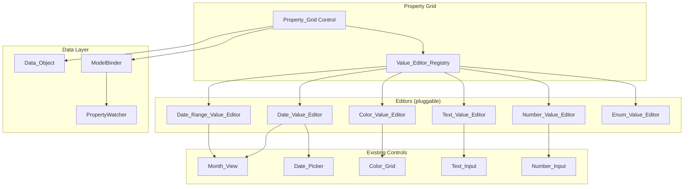
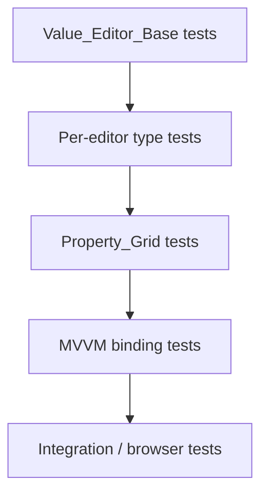

# Property Value Editors — Architecture & Integration Book

A comprehensive guide to building a **Visual Studio–style property grid** in jsgui3, where each property row chooses the correct popup editor based on its data type: date pickers, color pickers, enums, numbers, text, and more.

---

## Table of Contents

1. [Core Concept: the Value Editor Registry](#1-core-concept-the-value-editor-registry)
2. [The `Value_Editor` Interface](#2-the-value_editor-interface)
3. [How It Connects to Existing Architecture](#3-how-it-connects-to-existing-architecture)
4. [Concrete Editor Types](#4-concrete-editor-types)
5. [Property Grid Control](#5-property-grid-control)
6. [Data_Object and MVVM Integration](#6-data_object-and-mvvm-integration)
7. [Popup / Inline Editor Patterns](#7-popup--inline-editor-patterns)
8. [Minimal Wiring Example](#8-minimal-wiring-example)
9. [Advanced Topics](#9-advanced-topics)
10. [Existing Components Summary](#10-existing-components-summary)
11. [Keyboard Navigation](#11-keyboard-navigation)
12. [Validation and Error Display](#12-validation-and-error-display)
13. [Multi-Object Selection ("Varies" State)](#13-multi-object-selection-varies-state)
14. [Accessibility (ARIA)](#14-accessibility-aria)
15. [Testing Strategy](#15-testing-strategy)
16. [Bridging swap_registry and value_editor_registry](#16-bridging-swap_registry-and-value_editor_registry)

---

## 1. Core Concept: the Value Editor Registry

The central idea is a **type → editor** lookup table. When a property grid needs to render a value cell, it asks: *"What editor handles this type?"*.

### 1.1 Registry Design

```javascript
// value_editor_registry.js
'use strict';

const registry = new Map();

/**
 * Register an editor class for a value type.
 * @param {string} type_name - e.g. 'date', 'color', 'date_range', 'enum', 'number'
 * @param {Function} editor_class - Control class that implements Value_Editor interface
 * @param {Object} [options] - { priority, inline, popup, predicate }
 */
function register_value_editor(type_name, editor_class, options = {}) {
    registry.set(type_name, {
        editor_class,
        priority: options.priority || 0,
        inline: options.inline !== false,   // can edit inline?
        popup: options.popup !== false,      // can open as popup?
        predicate: options.predicate || null // optional filter
    });
}

/**
 * Look up the best editor for a type.
 * @param {string} type_name
 * @param {Object} [context] - Optional context for predicate evaluation
 * @returns {{ editor_class, inline, popup } | null}
 */
function get_value_editor(type_name, context) {
    const entry = registry.get(type_name);
    if (!entry) return null;
    if (entry.predicate && !entry.predicate(context)) return null;
    return entry;
}

/**
 * Create an editor instance for a value.
 * @param {string} type_name
 * @param {Object} spec - Control spec forwarded to editor constructor
 * @returns {Control} The editor control instance
 */
function create_editor(type_name, spec) {
    const entry = get_value_editor(type_name, spec);
    if (!entry) return null;
    return new entry.editor_class(spec);
}

module.exports = { register_value_editor, get_value_editor, create_editor, registry };
```

### 1.2 Why a Registry?

| Approach | Pros | Cons |
|----------|------|------|
| Hard-coded `if/else` (current `Object_Editor`) | Simple | Can't extend without modifying source |
| Registry (proposed) | Open/closed, plugin-friendly | One extra indirection |
| CSS-selector swap (`swap_registry`) | Works for DOM upgrade | Too coarse for typed popup editors |

The registry complements `swap_registry` — it operates at the **data type** level, not the DOM selector level.

---

## 2. The `Value_Editor` Interface

Every editor control must implement a minimal contract so the property grid can use it interchangeably:

### 2.1 Interface Contract

```javascript
/**
 * Value_Editor interface — any control that edits a typed value.
 *
 * Required:
 *   get_value()            → returns the current value in its canonical form
 *   set_value(value, opts) → sets the value; opts.silent skips events
 *   on('value-change', fn) → raised when the user changes the value
 *
 * Optional:
 *   validate()             → returns { valid, message } or true
 *   get_display_text()     → short text representation for inline display
 *   open_popup(anchor_el)  → opens a popup/dropdown editor
 *   close_popup()          → closes popup
 *   static type_name       → the registered type string
 *   static display_name    → human-readable label
 */
```

### 2.2 Base Class

```javascript
// value_editors/Value_Editor_Base.js
const Control = require('jsgui3-html').Control;

class Value_Editor_Base extends Control {
    constructor(spec = {}) {
        super(spec);
        this._value = spec.value !== undefined ? spec.value : null;
    }

    get_value() { return this._value; }

    set_value(value, opts = {}) {
        const old = this._value;
        this._value = value;
        if (!opts.silent) {
            this.raise('value-change', { old, value, source: opts.source || 'api' });
        }
    }

    get_display_text() {
        return this._value != null ? String(this._value) : '';
    }

    validate() { return { valid: true }; }
}

module.exports = Value_Editor_Base;
```

### 2.3 Key Design Decision: Minimal Surface

The interface is intentionally small. This means:
- A plain `<input>` wrapped in `Value_Editor_Base` works for string/number
- A `Month_View` wrapped with `get_value()`/`set_value()` works for dates
- A `Color_Grid` wrapped the same way works for colors
- **Zero special APIs** needed per type beyond `get_value`/`set_value`/`value-change`

---

## 3. How It Connects to Existing Architecture

### 3.1 Architecture Diagram



### 3.2 Relationship to Existing Systems

| Existing System | Role in Property Grid |
|----------------|----------------------|
| `Object_Editor.create_value_control()` | **Predecessor** — hard-coded type dispatch that the registry replaces |
| `swap_registry` | **Complementary** — handles native DOM element upgrades; registry handles data-type editors |
| `ModelBinder` | **Data plumbing** — binds `Data_Object` fields to editor `get_value`/`set_value` |
| `PropertyWatcher` | **Change detection** — watches `Data_Object` for external changes and pushes them to editors |
| `Data_Model_View_Model_Control` | **Optional MVVM base** — editors can extend this for complex state |
| `input_api` / `input_base` | **Mixin** — applies unified `set_value`/`get_value`/validation to native inputs |
| `Property_Editor` | **Simpler alternative** — form-panel approach; Property_Grid is the VS-style approach |

---

## 4. Concrete Editor Types

### 4.1 Date Editor

Wraps `Month_View` in single-select mode. The popup shows the calendar; the inline display shows `YYYY-MM-DD`.

```javascript
const Value_Editor_Base = require('./Value_Editor_Base');
const Month_View = require('jsgui3-html/controls/.../month-view');

class Date_Value_Editor extends Value_Editor_Base {
    static type_name = 'date';
    static display_name = 'Date';

    constructor(spec = {}) {
        super(spec);
        this._month_view = new Month_View({
            context: this.context,
            selection_mode: 'single',
            min_date: spec.min_date,
            max_date: spec.max_date
        });
    }

    compose_popup() {
        this._popup = this._month_view;
        return this._popup;
    }

    get_display_text() {
        return this._value || '(no date)';
    }

    // Wire Month_View selection → value-change
    activate() {
        super.activate();
        this._month_view.on('change', e => {
            if (e.name === 'day') {
                const iso = `${this._month_view.year}-${String(this._month_view.month + 1).padStart(2, '0')}-${String(e.value.value).padStart(2, '0')}`;
                this.set_value(iso, { source: 'user' });
            }
        });
    }
}

// Register
const { register_value_editor } = require('../value_editor_registry');
register_value_editor('date', Date_Value_Editor, { popup: true, inline: true });

module.exports = Date_Value_Editor;
```

### 4.2 Date Range Editor

Uses `Month_View` in `range` mode. Value is `{ start, end }`.

```javascript
class Date_Range_Value_Editor extends Value_Editor_Base {
    static type_name = 'date_range';

    constructor(spec = {}) {
        super(spec);
        this._month_view = new Month_View({
            context: this.context,
            selection_mode: 'range',
            min_date: spec.min_date,
            max_date: spec.max_date
        });
    }

    set_value(value, opts = {}) {
        super.set_value(value, opts);
        if (value && value.start && value.end) {
            this._month_view.set_range(value.start, value.end);
        }
    }

    get_value() {
        return {
            start: this._month_view.range_start,
            end: this._month_view.range_end
        };
    }

    get_display_text() {
        const v = this.get_value();
        if (v.start && v.end) return `${v.start} → ${v.end}`;
        return '(no range)';
    }

    activate() {
        super.activate();
        this._month_view.on('range-change', e => {
            this.set_value({ start: e.start, end: e.end }, { source: 'user' });
        });
    }
}

register_value_editor('date_range', Date_Range_Value_Editor, { popup: true });
```

### 4.3 Color Editor

Uses `Color_Grid` with palette. Value is a hex string like `'#ff6600'`.

```javascript
class Color_Value_Editor extends Value_Editor_Base {
    static type_name = 'color';

    constructor(spec = {}) {
        super(spec);
        this._color_grid = new Color_Grid({
            context: this.context,
            palette: spec.palette || default_palette,
            size: [180, 180],
            grid_size: [6, 6]
        });
    }

    get_display_text() {
        return this._value || '(no color)';
    }

    activate() {
        super.activate();
        this._color_grid.on('choose-color', e => {
            this.set_value(e.value, { source: 'user' });
        });
    }
}

register_value_editor('color', Color_Value_Editor, { popup: true });
```

### 4.4 Enum Editor (Dropdown)

For properties with a fixed set of values. Value is a string matching one of the options.

```javascript
class Enum_Value_Editor extends Value_Editor_Base {
    static type_name = 'enum';

    constructor(spec = {}) {
        super(spec);
        this._options = spec.options || [];  // ['option1', 'option2', ...]
    }

    // Renders as a <select> dropdown — no popup needed
    compose_inline() {
        const sel = new Control({ context: this.context, tag_name: 'select' });
        this._options.forEach(opt => {
            const option = new Control({ context: this.context, tag_name: 'option' });
            option.dom.attributes.value = opt;
            option.add(opt);
            if (opt === this._value) option.dom.attributes.selected = 'selected';
            sel.add(option);
        });
        this._select = sel;
        return sel;
    }

    activate() {
        super.activate();
        this._select.on('change', () => {
            this.set_value(this._select.dom.el.value, { source: 'user' });
        });
    }
}

register_value_editor('enum', Enum_Value_Editor, { inline: true, popup: false });
```

### 4.5 Text / Number / Boolean Editors

These are thin wrappers around existing native controls (`Text_Input`, `Number_Input`, `<input type="checkbox">`). They follow the same `Value_Editor_Base` contract.

---

## 5. Property Grid Control

The **Property_Grid** is the VS-style two-column table. Each row is a `{ key, type, value, options }` descriptor.

### 5.1 Schema-Driven Rows

```javascript
const schema = [
    { key: 'name',          type: 'text',       label: 'Name' },
    { key: 'birth_date',    type: 'date',       label: 'Birth Date' },
    { key: 'active_period', type: 'date_range',  label: 'Active Period' },
    { key: 'accent_color',  type: 'color',      label: 'Accent Color' },
    { key: 'role',          type: 'enum',       label: 'Role', options: ['admin', 'user', 'guest'] },
    { key: 'age',           type: 'number',     label: 'Age', min: 0, max: 150 },
    { key: 'enabled',       type: 'boolean',    label: 'Enabled' }
];
```

### 5.2 Property_Grid Sketch

```javascript
const Control = require('jsgui3-html').Control;
const { create_editor } = require('./value_editor_registry');

class Property_Grid extends Control {
    constructor(spec = {}) {
        spec.__type_name = spec.__type_name || 'property_grid';
        super(spec);
        this.add_class('property-grid');

        this._schema = spec.schema || [];
        this._data = spec.data || {};        // plain object or Data_Object
        this._editors = new Map();           // key → editor instance

        if (!spec.el) this.compose_grid();
    }

    compose_grid() {
        this._schema.forEach(field => {
            const row = new Control({ context: this.context, tag_name: 'div' });
            row.add_class('pg-row');

            // Label cell
            const label = new Control({ context: this.context, tag_name: 'div' });
            label.add_class('pg-label');
            label.add(field.label || field.key);
            row.add(label);

            // Value cell — delegate to registry
            const value_cell = new Control({ context: this.context, tag_name: 'div' });
            value_cell.add_class('pg-value');

            const editor = create_editor(field.type, {
                context: this.context,
                value: this._data[field.key],
                ...field  // forward min, max, options, palette, etc.
            });

            if (editor) {
                value_cell.add(editor);
                this._editors.set(field.key, editor);
            }

            row.add(value_cell);
            this.add(row);
        });
    }

    activate() {
        if (!this.__active) {
            super.activate();
            // Wire editors back to data
            for (const [key, editor] of this._editors) {
                editor.on('value-change', e => {
                    this._data[key] = e.value;
                    this.raise('property-change', { key, value: e.value, old: e.old });
                });
            }
        }
    }

    // Bulk get/set
    get_values() {
        const result = {};
        for (const [key, editor] of this._editors) {
            result[key] = editor.get_value();
        }
        return result;
    }

    set_values(data) {
        for (const [key, editor] of this._editors) {
            if (key in data) editor.set_value(data[key], { silent: true });
        }
    }
}
```

### 5.3 CSS (VS-style)

```css
.property-grid {
    display: grid;
    grid-template-columns: minmax(120px, 180px) 1fr;
    border: 1px solid var(--pg-border, #d1d5db);
    border-radius: 4px;
    font-size: 13px;
    font-family: 'Segoe UI', system-ui, sans-serif;
}
.pg-row {
    display: contents;
}
.pg-label {
    padding: 4px 8px;
    background: var(--pg-label-bg, #f3f4f6);
    border-bottom: 1px solid var(--pg-border, #d1d5db);
    font-weight: 500;
    color: var(--pg-label-text, #374151);
}
.pg-value {
    padding: 2px 4px;
    border-bottom: 1px solid var(--pg-border, #d1d5db);
    display: flex;
    align-items: center;
}
```

---

## 6. Data_Object and MVVM Integration

### 6.1 Binding to Data_Object

When the property grid's data source is a `Data_Object` (from `lang-tools`), use `ModelBinder` for 2-way sync:

```javascript
const { ModelBinder } = require('jsgui3-html/html-core/ModelBinder');

class Property_Grid_MVVM extends Property_Grid {
    bind_to_model(data_object) {
        const bindings = {};

        for (const field of this._schema) {
            const editor = this._editors.get(field.key);
            if (!editor) continue;

            // Data_Object.change → editor.set_value
            data_object.on('change', e => {
                if (e.name === field.key) {
                    editor.set_value(e.value, { silent: true, source: 'model' });
                }
            });

            // editor.value-change → Data_Object.set
            editor.on('value-change', e => {
                if (e.source !== 'model') {
                    data_object.set(field.key, e.value);
                }
            });
        }

        // Initial sync
        for (const field of this._schema) {
            const val = data_object.get(field.key);
            if (val !== undefined) {
                this._editors.get(field.key)?.set_value(val, { silent: true });
            }
        }
    }
}
```

### 6.2 Using ModelBinder Transforms

For properties where the model value differs from the editor value (e.g. a `Date` object in the model but the editor uses ISO strings):

```javascript
const binder = new ModelBinder(data_object, view_model, {
    'birth_date': {
        to: 'birth_date_iso',
        transform: (date) => date.toISOString().slice(0, 10),   // Date → 'YYYY-MM-DD'
        reverse: (iso) => new Date(iso)                          // 'YYYY-MM-DD' → Date
    },
    'accent_color': {
        to: 'accent_color_hex',
        transform: (rgb) => rgbToHex(rgb),
        reverse: (hex) => hexToRgb(hex)
    }
});
```

### 6.3 PropertyWatcher for Reactive Updates

```javascript
const { PropertyWatcher } = require('jsgui3-html/html-core/ModelBinder');

// Watch for external changes and push to editors
new PropertyWatcher(data_object, 'birth_date', (newVal, oldVal) => {
    const editor = property_grid._editors.get('birth_date');
    editor.set_value(newVal, { source: 'model' });
});
```

---

## 7. Popup / Inline Editor Patterns

### 7.1 Inline Editors

Simple types (text, number, boolean, enum) render directly in the value cell. There is no dropdown or popup. These use the existing native control wrappers.

### 7.2 Popup Editors

Complex types (date, date_range, color) display a **summary text** inline and open a **popup** when clicked:

```javascript
// Inside the value cell:
//  ┌──────────────────────────────────┐
//  │  2026-01-15  [▾]                 │ ← inline summary + dropdown trigger
//  └──────────────────────────────────┘
//  ┌──────────────────────────────────┐
//  │  ┌─────────────────────────────┐ │
//  │  │  << Jan 2026 >>             │ │ ← popup: Month_View
//  │  │  Mo Tu We Th Fr Sa Su       │ │
//  │  │   .  .  .  1  2  3  4      │ │
//  │  │   5  6  7  8  9 10 11      │ │
//  │  │  ...                        │ │
//  │  └─────────────────────────────┘ │
//  └──────────────────────────────────┘
```

### 7.3 Popup Container Pattern

```javascript
class Popup_Editor_Wrapper extends Control {
    constructor(spec) {
        super(spec);
        this.add_class('popup-editor-wrapper');

        // Inline summary
        this._summary = new Control({ context: this.context, tag_name: 'span' });
        this._summary.add_class('popup-summary');
        this.add(this._summary);

        // Dropdown button
        this._trigger = new Control({ context: this.context, tag_name: 'button' });
        this._trigger.add_class('popup-trigger');
        this._trigger.add('▾');
        this.add(this._trigger);

        // Popup container (hidden by default)
        this._popup = new Control({ context: this.context, tag_name: 'div' });
        this._popup.add_class('popup-dropdown');
        this._popup.dom.attributes.style = { display: 'none' };
        this.add(this._popup);
    }

    set_editor(editor_control) {
        this._popup.add(editor_control);
        this._editor = editor_control;
    }

    activate() {
        super.activate();
        this._trigger.on('click', () => this.toggle_popup());
        // Close on outside click
        document.addEventListener('mousedown', e => {
            if (this._open && !this._popup.dom.el.contains(e.target)) {
                this.close_popup();
            }
        });
    }

    toggle_popup() { this._open ? this.close_popup() : this.open_popup(); }
    open_popup() { this._popup.dom.el.style.display = 'block'; this._open = true; }
    close_popup() { this._popup.dom.el.style.display = 'none'; this._open = false; }
}
```

---

## 8. Minimal Wiring Example

A complete, end-to-end example showing how little code is needed:

```javascript
const jsgui = require('jsgui3-html');
const { register_value_editor, create_editor } = require('./value_editor_registry');
const Property_Grid = require('./Property_Grid');

// Step 1: Register editors (done once at startup)
require('./value_editors/date_editor');     // self-registers
require('./value_editors/color_editor');    // self-registers
require('./value_editors/text_editor');     // self-registers

// Step 2: Define schema
const schema = [
    { key: 'name',       type: 'text',  label: 'Name' },
    { key: 'birth_date', type: 'date',  label: 'Birth Date' },
    { key: 'color',      type: 'color', label: 'Theme Color' }
];

// Step 3: Create and use
const grid = new Property_Grid({
    context,
    schema,
    data: { name: 'Alice', birth_date: '2000-06-15', color: '#2563eb' }
});

page.add(grid);

// Step 4: Listen for changes
grid.on('property-change', e => {
    console.log(`${e.key} changed to`, e.value);
});
```

**Total wiring: 4 lines.** The registry and `Value_Editor_Base` interface handle everything else.

---

## 9. Advanced Topics

### 9.1 Grouped Properties

Property grids often organize properties into collapsible groups:

```javascript
const schema = [
    { group: 'Appearance', fields: [
        { key: 'color', type: 'color', label: 'Color' },
        { key: 'opacity', type: 'number', label: 'Opacity', min: 0, max: 1, step: 0.1 }
    ]},
    { group: 'Dates', fields: [
        { key: 'created', type: 'date', label: 'Created' },
        { key: 'range', type: 'date_range', label: 'Active Period' }
    ]}
];
```

### 9.2 Dynamic Schema

When the selected object changes type, the grid rebuilds:

```javascript
selection_scope.on('change', e => {
    if (e.name === 'selected') {
        const item = e.value;
        const new_schema = schema_for_type(item.__type_name);
        property_grid.set_schema(new_schema, item);
    }
});
```

### 9.3 Custom Editor Registration

Third-party code can register new editor types without touching core:

```javascript
// In a plugin file:
const { register_value_editor } = require('./value_editor_registry');
const Slider_Editor = require('./my_slider_editor');

register_value_editor('slider', Slider_Editor, {
    popup: false,
    inline: true,
    priority: 10
});
```

### 9.4 Read-Only Mode

Each editor can respect a `read_only` flag:

```javascript
{ key: 'id', type: 'text', label: 'ID', read_only: true }
```

The property grid passes this to the editor, which disables interaction.

### 9.5 Complexity to Defer

The following MVVM complexities can be **ignored initially** and added later:

| Complexity | Status | Notes |
|-----------|--------|-------|
| Full `Data_Model_View_Model_Control` base for Property_Grid | Defer | Simple `on('change')` works fine initially |
| `ModelBinder` transforms per field | Defer | Direct `set`/`get` is simpler |
| Server-side rendering of popup state | Defer | Popups are client-only |
| Undo/redo via `Data_Object` history | Defer | Nice-to-have for VS-style UX |
| `ComputedProperty` for derived fields | Defer | Can be layered on when needed |

---

## 10. Existing Components Summary

### Controls Ready to Wrap

| Control | File | Value Type | Wrap As |
|---------|------|-----------|---------|
| `Month_View` | `1-compositional/month-view.js` | `date`, `date_range`, `week` | `Date_Value_Editor`, `Date_Range_Value_Editor` |
| `Date_Picker` (complex) | `_complex_date-picker.js` | `date` (with nav) | Alternative to `Date_Value_Editor` (adds year/month nav) |
| `Color_Grid` | `1-compositional/color-grid.js` | `color` | `Color_Value_Editor` |
| `Color_Palette` | `1-compositional/color-palette.js` | `color` (expanded) | Alternative color editor |
| `Text_Input` | `0-native-compositional/Text_Input.js` | `text` | `Text_Value_Editor` |
| `Number_Input` | `0-native-compositional/number_input.js` | `number` | `Number_Value_Editor` |
| `Checkbox` | `0-native-compositional/checkbox.js` | `boolean` | `Boolean_Value_Editor` |

### Infrastructure Ready to Use

| Module | File | Role |
|--------|------|------|
| `swap_registry` | `control_mixins/swap_registry.js` | CSS-selector→Control class swap (for DOM upgrade) |
| `ModelBinder` | `html-core/ModelBinder.js` | 2-way Data_Object binding with transforms |
| `PropertyWatcher` | `html-core/ModelBinder.js` | Watch single properties for changes |
| `ComputedProperty` | `html-core/ModelBinder.js` | Auto-computed derived values |
| `input_api` | `control_mixins/input_api.js` | Unified `set_value`/`get_value`/validation |
| `Object_Editor` | `1-editor/object.js` | Existing type-dispatched KVP editor (predecessor) |
| `Property_Editor` | `1-editor/property_editor.js` | Form-panel property editor (simpler approach) |

### Documentation

- [MVC_MVVM_Developer_Guide.md](file:///c:/Users/james/Documents/repos/jsgui3-html/docs/MVC_MVVM_Developer_Guide.md) — full MVVM patterns guide
- [color-picker-book/](file:///c:/Users/james/Documents/repos/jsgui3-html/docs/color-picker-book/) — 10-chapter color picker design book
- [month_view.md](file:///c:/Users/james/Documents/repos/jsgui3-html/docs/controls/month_view.md) — Month_View API reference
- [date_picker.md](file:///c:/Users/james/Documents/repos/jsgui3-html/docs/controls/date_picker.md) — Date_Picker reference

---

## 11. Keyboard Navigation

A VS-style property grid must be fully operable by keyboard. This is critical for power users and accessibility.

### 11.1 Grid-Level Navigation

| Key | Action |
|-----|--------|
| `Tab` / `Shift+Tab` | Move focus between rows (label→value→next row) |
| `↑` / `↓` | Move focus to previous / next property row |
| `Enter` | Activate the editor in the focused row (open popup or start inline editing) |
| `Escape` | Close popup, cancel edit, return focus to the row |
| `Home` / `End` | Jump to first / last property row |

### 11.2 Implementation in Property_Grid

```javascript
class Property_Grid extends Control {
    activate() {
        super.activate();
        this._focused_index = -1;
        const rows = this._get_row_elements();

        this.dom.el.addEventListener('keydown', e => {
            switch (e.key) {
                case 'ArrowDown':
                    e.preventDefault();
                    this._focus_row(this._focused_index + 1);
                    break;
                case 'ArrowUp':
                    e.preventDefault();
                    this._focus_row(this._focused_index - 1);
                    break;
                case 'Enter':
                    this._activate_editor(this._focused_index);
                    break;
                case 'Escape':
                    this._close_active_popup();
                    this._focus_row(this._focused_index); // return focus to row
                    break;
                case 'Home':
                    e.preventDefault();
                    this._focus_row(0);
                    break;
                case 'End':
                    e.preventDefault();
                    this._focus_row(rows.length - 1);
                    break;
            }
        });
    }

    _focus_row(index) {
        const rows = this._get_row_elements();
        if (index < 0 || index >= rows.length) return;
        this._focused_index = index;
        rows[index].focus();
        this.raise('row-focus', { index, key: this._schema[index]?.key });
    }
}
```

### 11.3 Editor-Level Keyboard

Each editor type should handle keys appropriate to its content:

| Editor | Key Handling |
|--------|-------------|
| `Text_Value_Editor` | Standard text input keys; `Enter` to commit, `Escape` to revert |
| `Number_Value_Editor` | `↑`/`↓` to increment/decrement by step; `Enter` to commit |
| `Date_Value_Editor` | `←`/`→`/`↑`/`↓` to navigate calendar days; `Enter` to select |
| `Color_Value_Editor` | `←`/`→`/`↑`/`↓` to navigate grid cells; `Enter` to select |
| `Enum_Value_Editor` | `↑`/`↓` cycles options; `Enter` to commit |
| `Boolean_Value_Editor` | `Space` to toggle; no popup |

The `Value_Editor_Base` can provide a default `handle_keydown(e)` that subclasses override:

```javascript
class Value_Editor_Base extends Control {
    handle_keydown(e) {
        if (e.key === 'Escape') {
            this.raise('editor-cancel');
            return true; // consumed
        }
        if (e.key === 'Enter') {
            this.raise('editor-commit', { value: this.get_value() });
            return true;
        }
        return false; // not consumed — bubble to grid
    }
}
```

---

## 12. Validation and Error Display

Editors should be able to report invalid state, and the property grid should display errors clearly.

### 12.1 Editor Validation API

The `validate()` method on `Value_Editor_Base` returns a result object:

```javascript
class Value_Editor_Base extends Control {
    validate() {
        // Override in subclasses
        return { valid: true, message: '' };
    }
}

// Example: Number_Value_Editor with min/max
class Number_Value_Editor extends Value_Editor_Base {
    validate() {
        const v = this.get_value();
        if (v === null || v === undefined || isNaN(v)) {
            return { valid: false, message: 'Value is not a number' };
        }
        if (this._min !== undefined && v < this._min) {
            return { valid: false, message: `Minimum value is ${this._min}` };
        }
        if (this._max !== undefined && v > this._max) {
            return { valid: false, message: `Maximum value is ${this._max}` };
        }
        return { valid: true };
    }
}
```

### 12.2 Validation in the Grid

The `Property_Grid` validates on every `value-change` and applies error styling:

```javascript
// Inside Property_Grid.activate()
editor.on('value-change', e => {
    const result = editor.validate();
    const row_el = this._row_elements.get(key);

    if (!result.valid) {
        row_el.classList.add('pg-row-invalid');
        row_el.setAttribute('title', result.message);
        this.raise('validation-error', { key, message: result.message });
    } else {
        row_el.classList.remove('pg-row-invalid');
        row_el.removeAttribute('title');
    }

    // Still propagate the change
    this._data[key] = e.value;
    this.raise('property-change', { key, value: e.value, valid: result.valid });
});
```

### 12.3 Error CSS

```css
.pg-row-invalid .pg-value {
    outline: 1px solid var(--pg-error-color, #ef4444);
    background: var(--pg-error-bg, #fef2f2);
}
.pg-row-invalid .pg-label {
    color: var(--pg-error-color, #ef4444);
}
```

### 12.4 Schema-Level Validators

Validation rules can also be specified in the schema:

```javascript
{ key: 'email', type: 'text', label: 'Email', validators: [
    { type: 'required', message: 'Email is required' },
    { type: 'pattern', pattern: /^[^@]+@[^@]+\.[^@]+$/, message: 'Invalid email format' }
]}
```

This integrates with the existing `Validators` from `html-core/Transformations.js`.

---

## 13. Multi-Object Selection ("Varies" State)

When multiple objects are selected in a master-detail UI, the property grid must handle properties that have **different values** across the selection.

### 13.1 The Problem

```
Selected: [Rectangle A, Rectangle B]

┌─────────────────┬─────────────────┐
│  Width          │  100            │  ← same value
│  Height         │  (varies)       │  ← different values
│  Color          │  ███ (varies)   │  ← different values
│  Visible        │  ☐ (varies)     │  ← different values
└─────────────────┴─────────────────┘
```

### 13.2 VARIES Sentinel

```javascript
const VARIES = Symbol('VARIES');

function merge_property_values(items, key) {
    if (items.length === 0) return undefined;
    const first = items[0][key];
    for (let i = 1; i < items.length; i++) {
        if (items[i][key] !== first) return VARIES;
    }
    return first;
}
```

### 13.3 Editor VARIES Support

`Value_Editor_Base` needs a `set_varies()` method:

```javascript
class Value_Editor_Base extends Control {
    set_varies() {
        this._varies = true;
        this._value = VARIES;
        // Update display
        if (this._display_el) {
            this._display_el.textContent = '(varies)';
            this._display_el.classList.add('pg-varies');
        }
    }

    // When user edits, clear varies state
    set_value(value, opts = {}) {
        this._varies = false;
        if (this._display_el) this._display_el.classList.remove('pg-varies');
        // ... normal set_value
    }
}
```

### 13.4 Grid Multi-Object Binding

```javascript
class Property_Grid extends Control {
    load_items(items) {
        this._items = items;
        for (const field of this._schema) {
            const editor = this._editors.get(field.key);
            if (!editor) continue;

            const merged = merge_property_values(items, field.key);
            if (merged === VARIES) {
                editor.set_varies();
            } else {
                editor.set_value(merged, { silent: true });
            }
        }
    }

    // When a user edits, apply to ALL selected items
    _on_editor_change(key, value) {
        for (const item of this._items) {
            item[key] = value;
        }
        this.raise('property-change', { key, value, items: this._items });
    }
}
```

### 13.5 CSS for Varies

```css
.pg-varies {
    color: var(--pg-varies-text, #9ca3af);
    font-style: italic;
}
```

---

## 14. Accessibility (ARIA)

A property grid is semantically a **grid** or **treegrid** (if groups are collapsible). Correct ARIA roles ensure screen readers can navigate it.

### 14.1 ARIA Roles

```html
<!-- Property Grid container -->
<div class="property-grid" role="grid" aria-label="Properties">

  <!-- Group header (if grouped) -->
  <div role="row" class="pg-group-header">
    <div role="columnheader" aria-expanded="true">Appearance</div>
  </div>

  <!-- Property row -->
  <div role="row" class="pg-row" tabindex="0" aria-rowindex="1">
    <div role="rowheader" class="pg-label">Color</div>
    <div role="gridcell" class="pg-value" aria-label="Color value">
      <button aria-haspopup="dialog" aria-expanded="false">██ #2563eb ▾</button>
    </div>
  </div>

  <!-- Boolean row -->
  <div role="row" class="pg-row" tabindex="0" aria-rowindex="2">
    <div role="rowheader" class="pg-label">Enabled</div>
    <div role="gridcell" class="pg-value">
      <input type="checkbox" role="switch" aria-label="Enabled" checked />
    </div>
  </div>
</div>
```

### 14.2 Key ARIA Attributes

| Element | Attribute | Purpose |
|---------|-----------|--------|
| Grid container | `role="grid"` | Indicates tabular, navigable structure |
| Each row | `role="row"`, `tabindex="0"` | Focusable row |
| Label cell | `role="rowheader"` | Property name acts as row header |
| Value cell | `role="gridcell"` | Editable value |
| Popup trigger | `aria-haspopup="dialog"`, `aria-expanded` | Indicates popup presence/state |
| Group header | `aria-expanded="true/false"` | Collapsible group |
| Invalid field | `aria-invalid="true"`, `aria-errormessage` | Validation state |

### 14.3 Implementation in compose_grid

```javascript
compose_grid() {
    this.dom.attributes.role = 'grid';
    this.dom.attributes['aria-label'] = this._spec.aria_label || 'Properties';

    this._schema.forEach((field, index) => {
        const row = new Control({ context: this.context, tag_name: 'div' });
        row.dom.attributes.role = 'row';
        row.dom.attributes.tabindex = '0';
        row.dom.attributes['aria-rowindex'] = String(index + 1);

        const label = new Control({ context: this.context, tag_name: 'div' });
        label.dom.attributes.role = 'rowheader';
        label.add(field.label || field.key);

        const value_cell = new Control({ context: this.context, tag_name: 'div' });
        value_cell.dom.attributes.role = 'gridcell';
        value_cell.dom.attributes['aria-label'] = `${field.label || field.key} value`;

        // ... add editor ...
    });
}
```

### 14.4 Focus Management

When a popup opens, focus should move into it. When it closes, focus returns to the triggering row. This uses the `aria-activedescendant` pattern or direct `focus()` management.

---

## 15. Testing Strategy

### 15.1 Unit Test Layers



### 15.2 Value_Editor_Base Tests

Test the contract that all editors must satisfy:

```javascript
describe('Value_Editor_Base', () => {
    it('should return initial value from get_value()', () => {
        const ed = new Value_Editor_Base({ context, value: 42 });
        expect(ed.get_value()).to.equal(42);
    });

    it('should raise value-change on set_value()', () => {
        const ed = new Value_Editor_Base({ context, value: 1 });
        let raised = null;
        ed.on('value-change', e => raised = e);
        ed.set_value(2);
        expect(raised).to.deep.include({ old: 1, value: 2 });
    });

    it('should NOT raise value-change when silent', () => {
        const ed = new Value_Editor_Base({ context, value: 1 });
        let raised = false;
        ed.on('value-change', () => raised = true);
        ed.set_value(2, { silent: true });
        expect(raised).to.be.false;
    });

    it('should return valid from validate() by default', () => {
        const ed = new Value_Editor_Base({ context });
        expect(ed.validate().valid).to.be.true;
    });
});
```

### 15.3 Per-Editor Tests

Each editor type tests its specific behaviour:

```javascript
describe('Date_Value_Editor', () => {
    it('should render a Month_View child', () => {
        const ed = new Date_Value_Editor({ context });
        expect(ed._month_view).to.exist;
    });

    it('should format display text as ISO date', () => {
        const ed = new Date_Value_Editor({ context, value: '2026-03-15' });
        expect(ed.get_display_text()).to.equal('2026-03-15');
    });

    it('should obey min/max bounds', () => {
        const ed = new Date_Value_Editor({
            context,
            min_date: '2026-01-01',
            max_date: '2026-12-31'
        });
        expect(ed._month_view._min_date).to.equal('2026-01-01');
        expect(ed._month_view._max_date).to.equal('2026-12-31');
    });
});
```

### 15.4 Property_Grid Tests

```javascript
describe('Property_Grid', () => {
    it('should create an editor per schema field', () => {
        const grid = new Property_Grid({
            context,
            schema: [
                { key: 'a', type: 'text', label: 'A' },
                { key: 'b', type: 'number', label: 'B' }
            ],
            data: { a: 'hello', b: 42 }
        });
        expect(grid._editors.size).to.equal(2);
    });

    it('should return all values from get_values()', () => {
        const grid = new Property_Grid({ context, schema, data });
        const vals = grid.get_values();
        expect(vals.a).to.equal('hello');
        expect(vals.b).to.equal(42);
    });

    it('should raise property-change on editor value-change', () => {
        const grid = new Property_Grid({ context, schema, data });
        let raised = null;
        grid.on('property-change', e => raised = e);
        grid._editors.get('a').set_value('world');
        expect(raised.key).to.equal('a');
        expect(raised.value).to.equal('world');
    });
});
```

### 15.5 MVVM Binding Tests

```javascript
describe('Property_Grid Data_Object binding', () => {
    it('should sync editor → Data_Object', () => {
        const obj = new Data_Object({});
        obj.set('name', 'Alice');
        const grid = new Property_Grid_MVVM({ context, schema, data: {} });
        grid.bind_to_model(obj);
        grid._editors.get('name').set_value('Bob');
        expect(obj.get('name')).to.equal('Bob');
    });

    it('should sync Data_Object → editor', () => {
        const obj = new Data_Object({});
        obj.set('name', 'Alice');
        const grid = new Property_Grid_MVVM({ context, schema, data: {} });
        grid.bind_to_model(obj);
        obj.set('name', 'Charlie');
        expect(grid._editors.get('name').get_value()).to.equal('Charlie');
    });
});
```

---

## 16. Bridging swap_registry and value_editor_registry

The two registries serve different purposes but can work together.

### 16.1 When to Use Which

| Scenario | Use |
|----------|----|
| Upgrading a `<input type="date">` in the DOM → complex calendar | `swap_registry` |
| Property grid asks "what editor for type 'date'?" | `value_editor_registry` |
| Progressive enhancement of server-rendered HTML | `swap_registry` |
| Building a UI from schema definitions | `value_editor_registry` |

### 16.2 Bridging Pattern

You can register the same editor in both registries:

```javascript
const { register_swap } = require('jsgui3-html/control_mixins/swap_registry');
const { register_value_editor } = require('./value_editor_registry');
const Date_Value_Editor = require('./value_editors/date_editor');

// For property grid (schema-driven)
register_value_editor('date', Date_Value_Editor, { popup: true });

// For progressive enhancement (DOM-driven)
register_swap('input[type="date"]', Date_Value_Editor, {
    priority: 10,
    enhancement_mode: 'full'
});
```

This way, the same `Date_Value_Editor` class serves two purposes:
1. Schema-driven creation in property grids
2. DOM upgrade of native `<input type="date">` elements

### 16.3 Shared Interface Benefit

Because both registries produce controls implementing `get_value()`/`set_value()`/`value-change`, consuming code doesn't need to know which registry was used. The `Property_Grid`, `Object_Editor`, or any parent control can blindly call `editor.get_value()` regardless of origin.

### 16.4 Migration Path from Object_Editor

The existing `Object_Editor.create_value_control()` can be gradually migrated:

```javascript
// Before: hard-coded dispatch
create_value_control(key, value, field_schema) {
    const type = field_schema?.type || typeof value;
    if (type === 'number') return new Number_Input(...);
    if (type === 'boolean') return new Checkbox(...);
    return new Text_Input(...);
}

// After: registry-first with fallback
create_value_control(key, value, field_schema) {
    const type = field_schema?.type || typeof value;

    // Try registry first
    const editor = create_editor(type, { context: this.context, value, ...field_schema });
    if (editor) return { wrapper: editor, input_ctrl: editor };

    // Fallback to existing hard-coded logic
    if (type === 'number') return new Number_Input(...);
    // ...
}
```

This allows incremental adoption — new editor types go through the registry, existing ones continue working.
